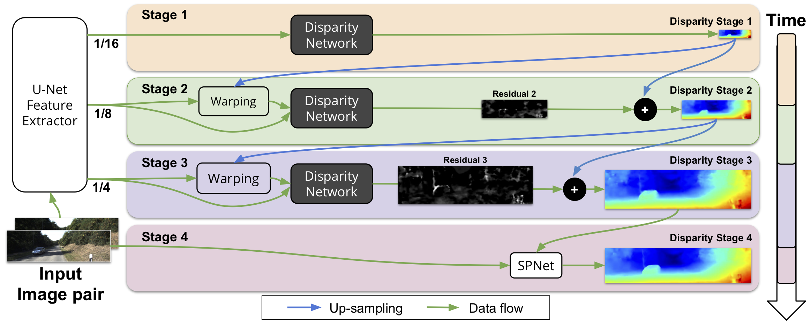
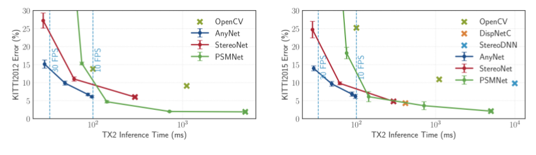

# Anytime Stereo Image Depth Estimation on Mobile Devices
This repository contains the code (in PyTorch) for AnyNet introduced in the following paper

[Anytime Stereo Image Depth Estimation on Mobile Devices](https://arxiv.org/abs/1810.11408)

by [Yan Wang∗](https://www.cs.cornell.edu/~yanwang/), Zihang Lai∗, [Gao Huang](http://www.gaohuang.net/), [Brian Wang](https://campbell.mae.cornell.edu/research-group/brian-wang), [Laurens van der Maaten](https://lvdmaaten.github.io/), [Mark Campbell](https://campbell.mae.cornell.edu/) and [Kilian Q. Weinberger](http://kilian.cs.cornell.edu/).

It has been accepted by International Conference on Robotics and Automation (ICRA) 2019.



### Citation
```
@article{wang2018anytime,
  title={Anytime Stereo Image Depth Estimation on Mobile Devices},
  author={Wang, Yan and Lai, Zihang and Huang, Gao and Wang, Brian H. and Van Der Maaten, Laurens and Campbell, Mark and Weinberger, Kilian Q},
  journal={arXiv preprint arXiv:1810.11408},
  year={2018}
}
```

## Contents

1. [Introduction](#introduction)
2. [Usage](#usage)
3. [Results](#results)
4. [Contacts](#contacts)

## Introduction

Many real-world applications of stereo depth es- timation in robotics require the generation of disparity maps in real time on low power devices. Depth estimation should be accurate, e.g. for mapping the environment, and real-time, e.g. for obstacle avoidance. Current state-of-the-art algorithms can either generate accurate but slow, or fast but high-error mappings, and typically have far too many parameters for low-power/memory devices. Motivated by this shortcoming we propose a novel approach for disparity prediction in the anytime setting. In contrast to prior work, our end-to-end learned approach can trade off computation and accuracy at inference time. The depth estimation is performed in stages, during which the model can be queried at any time to output its current best estimate. In the first stage it processes a scaled down version of the input images to obtain an initial low resolution sketch of the disparity map. This sketch is then successively refined with higher resolution details until a full resolution, high quality disparity map emerges. Here, we leverage the fact that disparity refinements can be performed extremely fast as the residual error is bounded by only a few pixels. Our final model can process 1242×375 resolution images within a range of 10-35 FPS on an NVIDIA Jetson TX2 module with only marginal increases in error – using two orders of magnitude fewer parameters than the most competitive baseline.


## Usage
0. Install dependencies
1. Generate the soft-links for the SceneFlow Dataset. You need to modify the `scenflow_data_path` to the actual SceneFlow path in `create_dataset.sh` file. 
    ```shell2html
     sh ./create_dataset.sh
    ```
2. Compile SPNet if SPN refinement is needed. (change NVCC path in make.sh when necessary)
    ```
    cd model/spn
    sh make.sh
    ```
### Dependencies

- [Python3.6](https://www.python.org/downloads/)
- [~~PyTorch(0.4.0)~~ Pytorch(1.0)](http://pytorch.org)
- ~~CUDA 8.0~~ CUDA 10.0
- [KITTI Stereo](http://www.cvlibs.net/datasets/kitti/eval_stereo.php)
- [Scene Flow](https://lmb.informatik.uni-freiburg.de/resources/datasets/SceneFlowDatasets.en.html)
### Update:
Now our code supports Pytorch 1.0! 
You have to recompile the spn module
```angular2
cd models/spn_t1
bash make.sh
```

### Train
Firstly, we use the following command to pretrained AnyNet on Scene Flow

```
python main.py --maxdisp 192 --with_spn
```

Secondly, we use the following command to finetune AnyNet on KITTI 2015 

```
python finetune.py --maxdisp 192 --with_spn --datapath path-to-kitti2015/training/
```

### Pretrained Models
You can download the pretrained model from [https://drive.google.com/file/d/18Vi68rQO-vcBn3882vkumIWtGggZQDoU/view?usp=sharing](https://drive.google.com/file/d/18Vi68rQO-vcBn3882vkumIWtGggZQDoU/view?usp=sharing).
It includes the SceneFlow, KITTI2012, KITTI2015 pretrained models. We also put the split files in the folder.

To evaluate the model on KITTI2012 
```
python finetune.py --maxdisp 192 --with_spn --datapath path-to-kitti2012/training/ \
   --save_path results/kitti2012 --datatype 2012 --pretrained checkpoint/kitti2012_ck/checkpoint.tar \
   --split_file checkpoint/kitti2012_ck/split.txt --evaluate
```
To evaluate the model on KITTI2015 
```
python finetune.py --maxdisp 192 --with_spn --datapath path-to-kitti2015/training/ \
    --save_path results/kitti2015 --datatype 2015 --pretrained checkpoint/kitti2015_ck/checkpoint.tar \
    --split_file checkpoint/kitti2015_ck/split.txt --evaluate
```
To fine-tune the ScenFlow pretrained model on KITTI2015 
```
python finetune.py --maxdisp 192 --with_spn --datapath path-to-kitti2015/training/ \
    --pretrained checkpoint/sceneflow/sceneflow.tar
```
To fine-tune the ScenFlow pretrained model on KITTI2012 
```
python finetune.py --maxdisp 192 --with_spn --datapath path-to-kitti2012/training/ \
    --pretrained checkpoint/sceneflow/sceneflow.tar --datatype 2012
```
Note:  All results reported in the paper are averaged over five randomized 80/20 train/validation splits.
 
### finetune on your own dataset
You have to organize your own dataset as the following format
```angular2
path-to-your-dataset/
    | training
        | image_2/           #left images
        | image_3/           #right images
        | disp_occ_0/        #left disparities
    | validation
        | image_2/           #left images
        | image_3/           #right images
        | disp_occ_0/        #left disparities
```
The disparity ground truth has to be stored as png format and multiplied by 256.
The finetune command is 
```angular2
python finetune.py --maxdisp 192 --with_spn --datapath path-to-your-dataset/ \
    --pretrained checkpoint/scenflow/sceneflow.tar --datatype other
```


## Results

 
